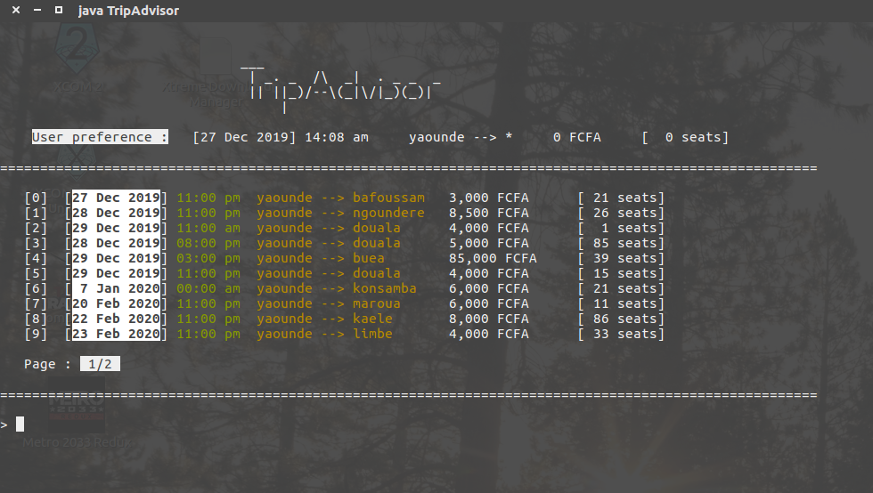

<p align="center">
	

	

	
</p>

<!--
<p align="center"></p>
-->

[//]: # (I used 'p' tag fot the badges because I needed to center the element.)
[//]: # (Otherwise, a good image old image with markdown syntax will have worked.)
[//]: # (eg: )

# TripAdvisor (Java App/CLI)


This little application allows the client to check the details of all local trips available inside the Country.
Unfortunately, the database is offline, and must be populated to be properly used. Perhaps in the future I will make an improvement regarding that matter.

One more thing ! This app have been extensively tested on `Linux` Operating System. Although it work on `Windows` as well, I do not guarantee the *quality of the UI*.

## Installation

> In this version, `dist/` folder already exist, so you can skip the installation process and go straight to usage section.

To be able to install this app, you must first have `java-sdk` installed on your computer to compile the source.
Once done, follow the procedure according to your Operating System.

### Linux

Open the terminal in the repository directory.

```
chmod +x install.sh
./install.sh
```

### Windows

Open the terminal in the repository directory (NOT TESTED YET, BEWARE !) :

```
/win-install.batch
```

## Usage

Once the compilation and installation completed, a new folder `dist` should be created.

Either you run `./launch.sh` for Linux, or `./win-launch.batch` for Windows,
Or you open the `dist` folder in the terminal and run `java TripAdvisor`

## Contributors

This project was made during `Fall 2019` by these awesome peoples :

* Steve Djumo
* Junior Ngogue
* Marcy Pepsi
* Carine Tanka

I was mostly in charge of all the UI and Databse stuffs.
Additionally, for convenience I created a proper filesystem hierarchy and some scripts for easier install and usage.
